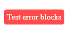
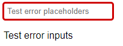
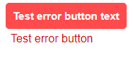
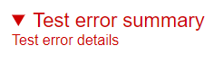
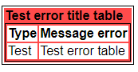

[](http://badge.fury.io/js/errlab)
[](https://img.shields.io/npm/dt/errlab.svg)
[](https://img.shields.io/npm/l/errlab)

> errlab is an error generator to have a faster development regarding the creation of errors.

[](https://www.npmjs.com/package/errlab)

## Table of contents:
  * [important](#important)
  * [instalation](#installation)
  * [class](#class)
  * [license software](#license-software)
___

## important:
  * errlab is in alpha phase so it may have several errors or things to improve.
  * to use errlab you need some backend framework like express.
___

## installation:
    npm install errlab
___

## class:
  * [block](#block-class)
  * [input](#input-class)
  * [button](#button-class)
  * [details](#details-class)
  * [table](#table-class)
___

### block-class:
The **block** class is used to create a block where you will put an error message.

**parameters:**
  1. **message:** this parameter is to define the message of the block.

a code of this class would look like this:
```js
const errlab = require('errlab');
const expres = require('express');
const app = expres();

app.get('/', (req, res)=> {
    res.send(new errlab.block({
      message: "Test error blocks"
    }).user());
});

app.listen(3000, ()=> {
    console.log('Server on port 3000');
});
```
I would give as an answer this:


___

### input-class:
The **input** class is used to create an input where you will put an error message.

**parameters:**
  1. **type:** this parameter is used to define the type of input.

  2. **placeholder:** this parameter is used to put a placeholder.

  3. **message:** this parameter is used to define the input message.

a code of this class would look like this:
```js
const errlab = require('errlab');
const expres = require('express');
const app = expres();

app.get('/', (req, res)=> {
    res.send(new errlab.input({
      type: "text",
      placeholder: "Test error placeholders",
      message: "Test error inputs"
    }).user());
});

app.listen(3000, ()=> {
    console.log('Server on port 3000');
});
```
I would give as an answer this:


___

### button-class:
The **button** class is used to create a block where you will put an error message.

**parameters:**
  1. **buttonText:** this parameter is used to define the text inside the button.

  2. **message:** this parameter is used to define the message of the button.

a code of this class would look like this:
```js
const errlab = require('errlab');
const expres = require('express');
const app = expres();

app.get('/', (req, res)=> {
    res.send(new errlab.button({
      buttonText: "Test error button text",
      message: "Test error button"
    }).user());
});

app.listen(3000, ()=> {
    console.log('Server on port 3000');
});
```
I would give as an answer this:


___

### details-class:
The **details** class is used to create a tab where you will put an error message.

**parameters:**
  1. **summary:** this parameter is used to define the text of the tab.

  2. **message:** this parameter is used to define the message of the tab.

a code of this class would look like this:
```js
const errlab = require('errlab');
const expres = require('express');
const app = expres();

app.get('/', (req, res)=> {
    res.send(new errlab.details({
      summary: "Test error summary",
      message: "Test error details"
    }).user());
});

app.listen(3000, ()=> {
    console.log('Server on port 3000');
});
```
I would give as an answer this:


___
### table-class:
The **table** class is used to create a block where you will put an error message.

**parameters:**
  1. **title:** this parameter is used to define the error title.

  2. **type:** this parameter is used to define the type of error in the table.

  3. **message:** this parameter is used to define the message of the table.

a code of this class would look like this:
```js
const errlab = require('errlab');
const expres = require('express');
const app = expres();

app.get('/', (req, res)=> {
    res.send(new errlab.table({
      title: "Test error title table",
      type: "Test",
      message: "Test error table"
    }).user());
});

app.listen(3000, ()=> {
    console.log('Server on port 3000');
});
```
I would give as an answer this:


___

<details>
  <summary id="license-software">license software</summary>

## license software:
```
MIT License

Copyright (c) 2021 ojitos
                
Permission is hereby granted, free of charge, to any person obtaining a copy
of this software and associated documentation files (the "Software"), to deal
in the Software without restriction, including without limitation the rights
to use, copy, modify, merge, publish, distribute, sublicense, and/or sell
copies of the Software, and to permit persons to whom the Software is
furnished to do so, subject to the following conditions:
                
The above copyright notice and this permission notice shall be included in all
copies or substantial portions of the Software.
                
THE SOFTWARE IS PROVIDED "AS IS", WITHOUT WARRANTY OF ANY KIND, EXPRESS OR
IMPLIED, INCLUDING BUT NOT LIMITED TO THE WARRANTIES OF MERCHANTABILITY,
FITNESS FOR A PARTICULAR PURPOSE AND NONINFRINGEMENT. IN NO EVENT SHALL THE
AUTHORS OR COPYRIGHT HOLDERS BE LIABLE FOR ANY CLAIM, DAMAGES OR OTHER
LIABILITY, WHETHER IN AN ACTION OF CONTRACT, TORT OR OTHERWISE, ARISING FROM,
OUT OF OR IN CONNECTION WITH THE SOFTWARE OR THE USE OR OTHER DEALINGS IN THE
SOFTWARE.
```
</details>